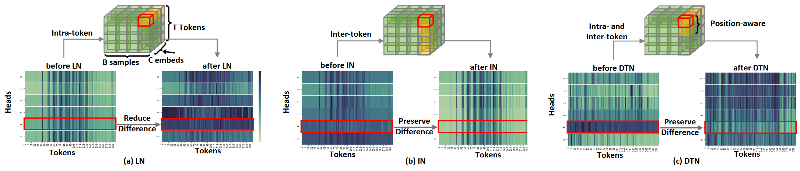
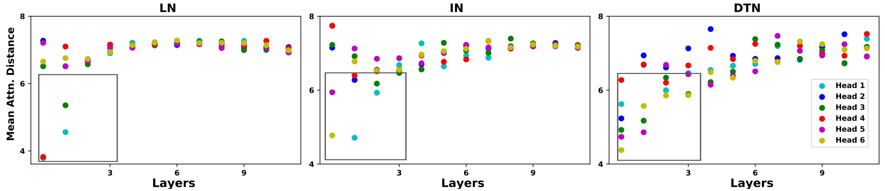

# Dynamic Token Normalization Improves Vision Transfromers, ICLR 2022

This is the PyTorch implementation of the paper [Dynamic Token Normalization Improves Vision Transformers](https://arxiv.org/abs/2112.02624) 
in ICLR 2022.


## Dynamic Token Normalization
We design a novel normalization method, termed Dynamic Token Normalization (DTN), which inherits the advantages from LayerNorm and InstanceNorm. DTN can be seamlessly plugged into various transformer models, consistenly improving the performance.
<div align=center></div>


## News
**2022-5-20** We release the code of DTN in training ViT and PVT. More models with DTN will be released soon.

## Main Results
**1. Performance** on ImageNet with ViT and its variants in terms of FLOPs, Parameters, Top-1, and Top-5 accuracies. H and C denote head number and embedding.

| Model | Norm | H | C | FLOPs | Params | Top-1 | Top-5 | 
| :-----| :----: | :----: | :----: | :----: | :----: | :----: | :----: |
| ViT-T | LN | 3 | 192| 1.26G| 5.7M| 72.2|91.3|
| ViT-T* | LN | 4 | 192| 1.26G| 5.7M| 72.3|91.4|
| ViT-T* | **DTN** | 4 | 192| 1.26G| 5.7M| 73.2|91.7|
| ViT-S* | LN | 6 | 384| 4.60G| 22.1M| 79.9|95.0|
| ViT-S* | **DTN** | 6 | 384| 4.88G| 22.1M| 80.6|95.3|
| ViT-B* | LN | 16 | 768| 17.58G| 86.5M| 81.7|95.0|
| ViT-B* | **DTN** | 16 | 768| 18.13G| 86.5M| 82.5|96.1|


**2. Comparison** between various normalizers in terms of Top-1 accuracy on ImageNet. ScN and PN denote ScaleNorm and PowerNorm, respectively.

| Model | LN | BN | IN | GN | SN | ScN| PN | **DTN**|
| :-----| :----: | :----: | :----: | :----: | :----: | :----: | :----: |:----: 
| ViT-S | 79.9 | 77.3 | 77.7| 78.3| 80.1| 80.0|79.8|**80.6**|
| ViT-S* | 80.6 | 77.2 | 77.6| 79.5| 81.0| 80.6|80.4|**81.7**|

**3. Visualization** of attention distance for each head in ViT-S. Many heads in ViT-S with DTN have a small mean
attention distance. Hence, DTN can capture local context well.

<div align=center></div>

## Getting Started
* Install [PyTorch](http://pytorch.org/)

### Requirements

- Install `CUDA==10.1` with `cudnn7` following
  the [official installation instructions](https://docs.nvidia.com/cuda/cuda-installation-guide-linux/index.html)
- Install `PyTorch==1.7.1` and `torchvision==0.8.2` with `CUDA==10.1`:

```bash
conda install pytorch==1.7.1 torchvision==0.8.2 cudatoolkit=10.1 -c pytorch
```

- Install `timm==0.4.9`:

```bash
pip install timm==0.4.9
```

### Data Preparation
- Download the ImageNet dataset which should contain train and val directionary and the txt file for correspondings between images and labels.

### Training a model from scratch
An example to train our DTN is given in DTN/scripts/train.sh. To train ViT-S* with our DTN, 
```
cd DTN/scripts   
sh train.sh layer vit_norm_s_star configs/ViT/vit.yaml
```
Number of GPUs and configuration file to use can be modified in train.sh

## License
DTN is released under BSD 3-Clause License.

## Acknowledgement
Our code is based on the implementation of timm package in PyTorch Image Models, https://github.com/rwightman/pytorch-image-models.

## Citation
If our code is helpful to your work, please cite:
```
@article{shao2021dynamic,
  title={Dynamic Token Normalization Improves Vision Transformer},
  author={Shao, Wenqi and Ge, Yixiao and Zhang, Zhaoyang and Xu, Xuyuan and Wang, Xiaogang and Shan, Ying and Luo, Ping},
  journal={arXiv preprint arXiv:2112.02624},
  year={2021}
}
```


